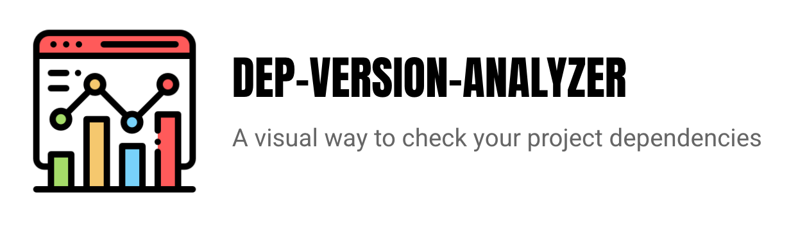
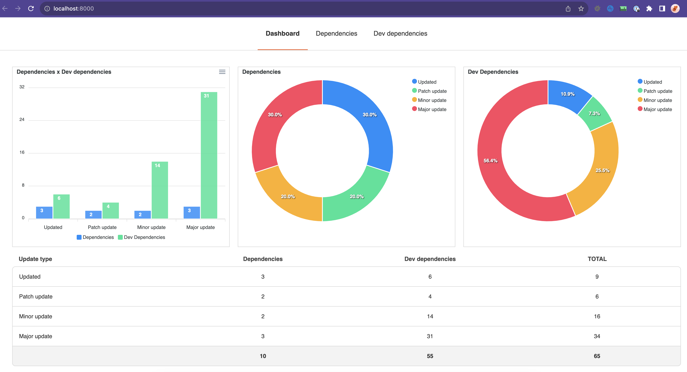

<p align="center">
  
</p>

## Get started

Run the following command in a folder that contains a `package.json` file and you should see the result in your browser:

```
👉 npx dep-version-analizer
```



## Contributing

### Getting the local project up and running

Clone this repo locally and install the dependencies:

```
yarn install
```

Run the application locally (it doesn't have a hot reload as it is all static files):

```
yarn start
```

### Building the project

After you change something in the `src` folder, you need to run `yarn build` to generate the `bin/view-template.js` file.

### Testing the command

If you already had installed or executed the command before, you will need to remove it first:

```
npm uninstall dep-version-analyzer -g
```

Then, install the local local project by executing `npm i -g`. Then you can execute the following command and it will be from your local project:

```
npx dep-version-analyzer
```
